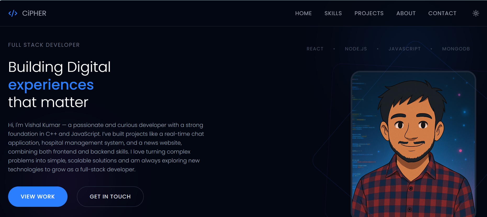
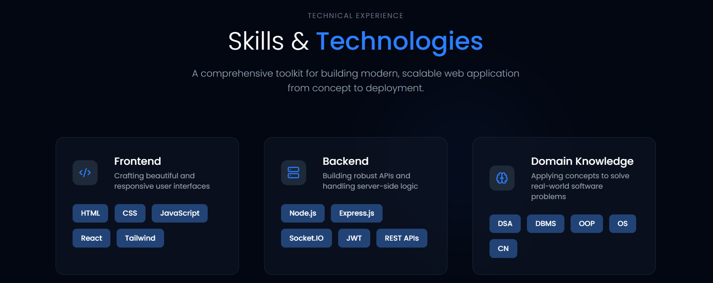
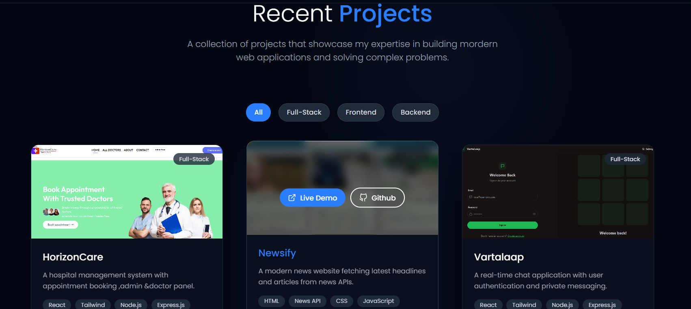
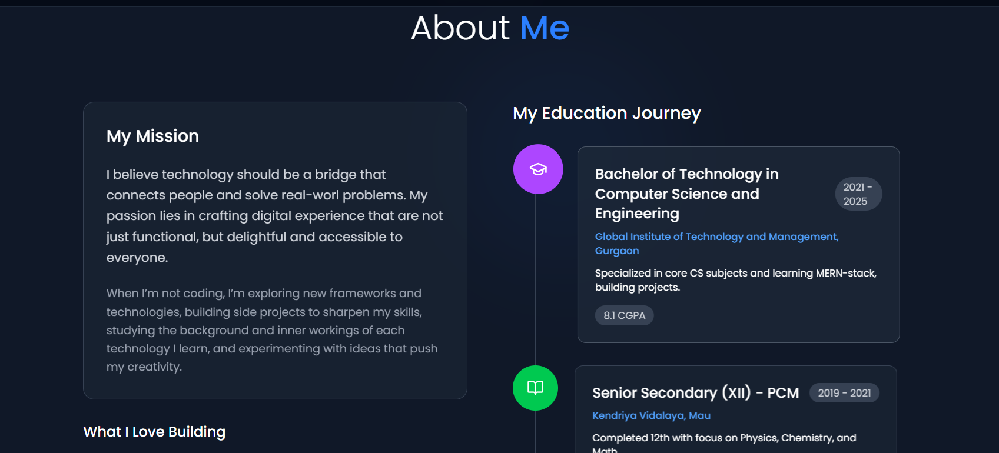
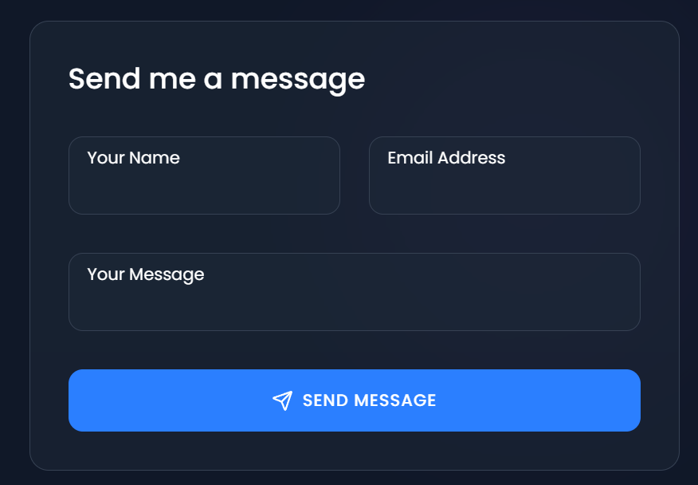
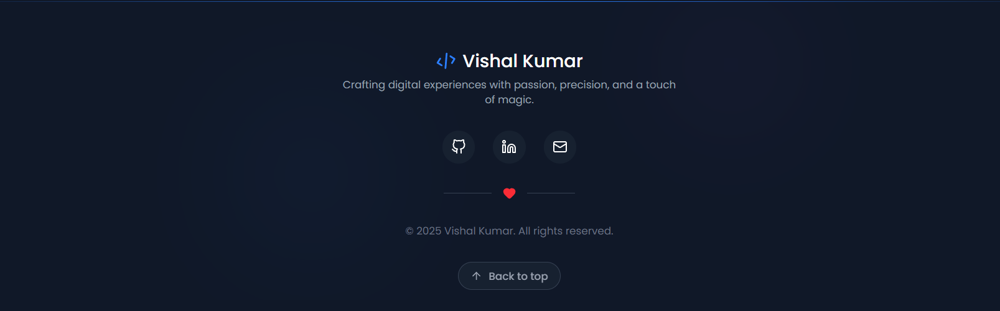

# Let's create the README.md file with the provided content.

🌟 Official Portfolio  

[](https://vishalkumar-cipher.netlify.app/)  
  
[](https://github.com/Official-CIPHER/Official-Portfolio/stargazers)  

Welcome to my **Official Portfolio** repository!  
This is my personal website built to showcase my **projects, skills, and professional journey** with a clean, modern UI.  

---

## ✨ Preview  

### 🏠 Home Page  
  

### 💼 Skills Section  
 

### 💼 Projects Section  
  
### 💼 About Section  
  
### 💼 Get In Touch Section  
  
### 💼 Footer Section  
  

---

## 🚀 Features  

✅ **Fully Responsive** – Works perfectly on all devices.  
✅ **Modern UI/UX** – Designed with Tailwind CSS for a sleek aesthetic.  
✅ **Smooth Animations** – Powered by Framer Motion.  
✅ **Interactive Projects Showcase** – Highlights my top work.  
✅ **About Me & Contact Sections** – Easy way to learn more and connect.  

---

## 🛠 Tech Stack  

- **React.js** ⚛️  
- **Tailwind CSS** 🎨  
- **Framer Motion** 🎥  

---

## 📂 Project Structure  

```bash
Official-Portfolio/
├── public/           # Static files
├── src/              # React components & pages
│   ├── assets/       # Images & icons
│   ├── components/   # Reusable UI components
│   ├── pages/        # Different sections/pages
│   └── App.js        # Main app file
├── package.json      # Dependencies & scripts
└── README.md         # Project documentation
```

---
<!-- 
## 📊 GitHub Stats  

  
  

--- -->

## 📬 Contact Me  

- 📧 **Email:** vishalkumar211103@gmail.com  
- 💼 **LinkedIn:** [Your LinkedIn](https://www.linkedin.com/in/vishal-kumar-vk70/)  
- 🐙 **GitHub:** [Official-CIPHER](https://github.com/Official-CIPHER)  

---

⭐ *If you like my portfolio, please consider giving it a star! It helps a lot.*  


